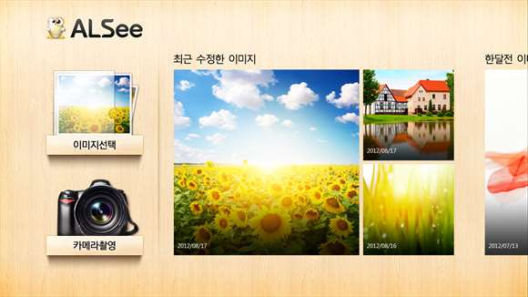

# Portfolio
김진훈 (82.04.07)

## Projects

OpenTide Korea & MIRACOM INC
* 통합컨퍼런스 - [web](https://sds.wyzmeeting.com/)\
기존에 개별로만 진행 가능했던 Video/Audio/Web conference를 동시에 진행할 수 있도록 지원하는 서비스 개발
  * 개발기간 : 2015.03 ~
  * 역할
    * 회의 예약/시작/종료/취소 로직 개발 (back-end)
    * 공용 모듈 개발 (recovery system 등)
    * 레거시 시스템 refectoring
  * Skills : Java, Spring, MS-SQL, MyBatis, MCU API
* Tizen Store Seller - [web](http://seller.tizenstore.com/)\
Tizen 단말의 app store인 Tizen Store의 Seller site 개발
  * 개발기간 : 2014.06 ~ 2015.02
  * 역할
    * 상품 파트 개발 (바이너리 업로드/파싱/검증/등록 & 가격 설정 로직)
    * 신규 국가 오픈 대응
    * 현장관리자 임무 수행
  * Skills :  Java, Spring, Oracle, MyBatis, Javascript, jQuery

ESTSoft
* Altools, Alyac API Server\
알툴즈, 알약 제품과 통신하는 API 서버 개발 진행
  * 개발기간 : 2012.09 ~ 2013.05
  * 담당업무
    * 알툴즈 장애보고 서비스 개선
    * 알약 고객상담 서비스 개선
    * 알약 장애알림 서비스 신규 개발
  * Skills : Java, Spring, MySQL, Mybatis, Restful API, Javascript, jQuery
* Windows 8 ALSee application
  * 개발기간 : 2012.04 ~ 2013.05
  * 역할
    * Windows 8 Store용 이미지 편집 Application\
    (animation, transition, layering, filtering, event handling) 구현
  * Skills : HTML5 (Canvas, Web worker), Javascript, Windows Store Application
  * 국내 노트북 제조사의 번들앱으로 제공됨
  * [제품소개](https://www.microsoft.com/ko-kr/store/apps/%EC%95%8C%EC%94%A8-%EC%82%AC%EC%A7%84%ED%8E%B8%EC%A7%91/9wzdncrfj1g2)
     > 알씨 윈도우앱은 쉽고 재미있게 사진을 꾸밀 수 있는 이미지 편집 프로그램 입니다.  PC에 저장되어 있거나 웹캡으로 찍은 이미지를 불러와 자르기, 회전 등의 기본 편집부터 색조절, 선명도 등의 보정기능, 여러가지 효과와 액자, 스티커, 그리기까지 다양한 편집 기능을 제공합니다. 화이트밸런스, 소프트포커스 등의 고급옵션으로 나의 사진을 한단계 업그레이드 해 보세요.
  * Image\
  
* ESTSoft Web service
  * 개발기간 : 2010.12 ~ 2012.04
  * 역할
    * [이스트소프트 사이트](www.estsoft.co.kr) 개선
    * [알툴즈 사이트](www.altools.co.kr) 개선
    * 영업관리 시스템 신규 개발
    * 매출 관리 시스템 개선
  * Skills : C#, .net, MS-SQL, Javascript, jQuery, Winform, SOAP
  * 회원 관리, 구매, 제품 출시, 채용, 매출 관리 등 다양한 업무 프로세스 경험

개인 projects
* ObjectWrapper (https://github.com/haloper/js-object-wrapper)
  * 개발 시기 : 2016
  * Javascript library
  * 목적 : Web 개발 시 설정 정보 같은 복잡한 사용자 정보를 손쉽게 관리하고 서버에 반영하기 위함
  * 주요 기능
    * 복잡한 구조의 object를 쉽게 탐색하고 수정 가능 - method chaining
    * Objbect 구조상의 모든 property 순회 (ForEachAll)
    * Object의 특정 상태값을 저장하고, 이후 변경사항을 추적하거나, 저장된 상태값으로 복원 가능
    * Object 동일성 비교
    * AMD, CommonJS 지원
  * Skills : Javascript, Jasmine (UnitTest)
* Nonlinear random (https://github.com/haloper/nonlinear-random)
  * 개발 시기 : 2016
  * Javascript library
  * 만들게된 계기 : 영어 단어 공부를 위해 간단한 web page를 만들어 사용하던 중, 문득 최근에 등록한 단어가 좀 더 자주 노출됐으면 좋겠다는 생각을 하게 됨. 그래서 모든 값이 고르게 생성되는 random 함수가 아닌, 다양한 형태로 변형 가능한 random 함수를 개발함.
  * 주요 기능
    * 특정한 패턴으로 노출빈도가 변형된 다양한 함수들을 제공
    * 사용자가 직접 패턴을 작성하여 자신만의 변형된 random 함수 구현 가능
    * AMD, CommonJS 지원
  * Skills : Javascript, Jasmine (UnitTest)
* PlayColor
  * 개발 시기 : 2014
  * Android application
  * 아이들이  
* PlayColor용 camera 연동 game framework
  * 개발 시기 : 2014
* SmartMode
  * 개발 시기 : 2009
