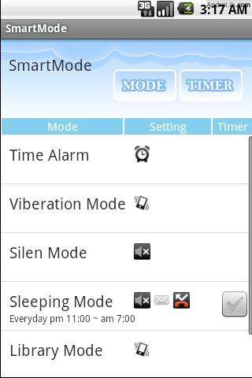

# Portfolio

김진훈 (82.04.07)

https://github.com/haloper

## Projects

### OpenTide Korea & MIRACOM Inc

2013-06-03 ~

OpenTide Korea로 입사 이후 MIRACOM Inc로 합병됨

#### 통합컨퍼런스 - [web](https://sds.wyzmeeting.com/)

기존에 개별로만 진행 가능했던 Video/Audio/Web conference를 동시에 진행할 수 있도록 지원하는 서비스 입니다.

  * 개발기간 : 2015.03 ~
  * 역할
    * 회의 예약/시작/종료/취소 로직 개발 (back-end)
    * 공용 모듈 개발 (recovery system 등)
    * 레거시 시스템 refectoring
  * Skills : Java, Spring, MS-SQL, MyBatis, MCU API

#### Tizen Store Seller - [web](http://seller.tizenstore.com/)

Tizen Store는 Tizen 단말에 포함된 app store이며, Seller 사이트는 개발자가 app을 등록하고 관리하는 서비스 입니다.

  * 개발기간 : 2014.06 ~ 2015.02
  * 역할
    * 상품 파트 개발 (바이너리 업로드/파싱/검증/등록 & 가격 설정 로직)
    * 신규 국가 오픈 대응
    * 현장관리자 임무 수행
  * Skills :  Java, Spring, Oracle, MyBatis, Javascript, jQuery

### ESTSoft

2010-12-21 ~ 2013-05-17

#### Altools, Alyac API Server

알툴즈, 알약 client 제품과 연동하는 API server를 개발하였습니다.

  * 개발기간 : 2012.09 ~ 2013.05
  * 담당업무
    * 알툴즈 장애보고 서비스 (알툴즈 제품의 오류 발생 시 오류 사항과 dump file을 업로드 받아 저장하는 서비스) 개선 작업 진행
    * 알약 고객상담 서비스 (알약 제품 사용 중 불만사항이나 건의사항을 입력 받는 서비스) 개선 작업 진행
    * 알약 장애알림 서비스 (알약 정상 실행 여부를 모니터링하고 접속 스케쥴을 관리해서 알약 비정상 사용 시 사용자에게 알림을 주는 서비스) 신규 개발 진행
  * Skills : Java, Spring, MySQL, Mybatis, Restful API, Javascript, jQuery
  
#### Windows 8 ALSee application

Windows 8 출시에 맞춰 새로운 사진 편집 application을 HTML5 & javascript 기반으로 개발했습니다. 사진 뷰어 기능은 제외하고, 터치만으로 손쉽게 사진을 편집할 수 있는 기능에 집중했습니다. (ALSee가 왜 사진 뷰어 기능이 없냐며 욕을 많이 먹기도 했습니다)

  * 개발기간 : 2012.04 ~ 2013.05
  * 역할
    * Windows 8 Store용 이미지 편집 Application (animation, transition, layering, filtering, event handling) 구현
  * Skills : HTML5 (Canvas, Web worker), Javascript, Windows Store Application
  * 국내 노트북 제조사의 번들앱으로 제공됨

[제품소개](https://www.microsoft.com/ko-kr/store/apps/%EC%95%8C%EC%94%A8-%EC%82%AC%EC%A7%84%ED%8E%B8%EC%A7%91/9wzdncrfj1g2)

> 알씨 윈도우앱은 쉽고 재미있게 사진을 꾸밀 수 있는 이미지 편집 프로그램 입니다. PC에 저장되어 있거나 웹캡으로 찍은 이미지를 불러와 자르기, 회전 등의 기본 편집부터 색조절, 선명도 등의 보정기능, 여러가지 효과와 액자, 스티커, 그리기까지 다양한 편집 기능을 제공합니다. 화이트밸런스, 소프트포커스 등의 고급옵션으로 나의 사진을 한단계 업그레이드 해 보세요.
 
  
  
  
  

#### ESTSoft Web service

이스트소프트 대내외로 사용되는 다양한 web server를 개발했습니다.

  * 개발기간 : 2010.12 ~ 2012.04
  * 역할
    * [이스트소프트 사이트](www.estsoft.co.kr) 개선
    * [알툴즈 사이트](www.altools.co.kr) 개선
    * 영업관리 시스템 (리셀러 관리 서비스) 신규 개발
    * 알툴즈, 알약 제품 매출 관리 시스템 개선
  * Skills : C#, .net, MS-SQL, Javascript, jQuery, Winform, SOAP
  * 회원 관리, 구매, 제품 출시, 채용, 매출 관리 등 다양한 업무 프로세스 경험

### 개인 projects

#### ObjectWrapper (https://github.com/haloper/js-object-wrapper)

Javascript Object에 부가기능을 제공해 주는 library로, Web 개발 시 설정 정보 같은 복잡한 사용자 정보를 손쉽게 관리하고 변경 사항을 서버에 쉽게 반영할 수 있습니다.

  * 개발 시기 : 2016
  * Javascript library
  * 주요 기능
    * 복잡한 구조의 object를 쉽게 탐색하고 수정 가능 - method chaining
    * Objbect 구조상의 모든 property 순회 (ForEachAll)
    * Object의 특정 상태값을 저장하고, 이후 변경사항을 추적하거나, 저장된 상태값으로 복원 가능
    * Object 동일성 비교
    * AMD, CommonJS 지원
  * Skills : Javascript, Jasmine (UnitTest)
   
#### Nonlinear random (https://github.com/haloper/nonlinear-random)

영어 단어 공부를 위해 간단한 web page를 만들어 사용하던 중, 문득 최근에 등록한 단어가 좀 더 자주 노출됐으면 좋겠다는 생각이 들었습니다. 그래서 모든 값이 고르게 생성되는 random 함수가 아닌, 다양한 형태로 변형 가능한 random 함수를 개발하였습니다.
  
  * 개발 시기 : 2016
  * Javascript library
  * 주요 기능
    * 특정한 패턴으로 노출빈도가 변형된 다양한 함수들을 제공
    * 사용자가 직접 패턴을 작성하여 자신만의 변형된 random 함수 구현 가능
    * AMD, CommonJS 지원
  * Skills : Javascript, Jasmine (UnitTest)
 
#### PlayColor

아이들이 스마트폰을 가지고 좀 더 동적으로 놀 수 있도록 하기 위해서 만들어 본 android application입니다. 정해진 색을 주위에서 찾아보는 단순한 놀이용 app입니다.

  * 개발 시기 : 2014
  * Android application
  * 카메라 연동 game framework 직접 개발
    * Resource 관리 : bitmap, audio, mask, resouce grouping
    * Animation : frame animation, transform, 색상 및 투명도 변환 animation
    * Event : graphic resource의 touch event, animation event

#### SmartMode

안드로이드 국내에 도입되던 시기에 공부삼아 만들어본 application입니다. 단순한 매너모드 대신에 사용자의 환경에 맞는 다양한 모드를 지원합니다. 몇 가지 예를 들어보면 아래와 같습니다.

수면 모드 : 중요한 전화만 수신되고 불필요한 전화는 자동으로 차단해 주는 모드입니다. 

영화 관람 모드 : 모든 전화를 차단하고 발신자에게 영화 종료시간을 문자로 발송합니다.

도서관 모드 : 진동 소리를 흉내낸 밸소리로 전환됩니다. (책상위에 핸드폰이 진동해서 책상이 큰소리로 울리는걸 방지합니다)

추가로 다양한 설정들을 조합하여, 자신만의 모드를 만들 수도 있습니다.

  * 개발 시기 : 2009
  * Android application

